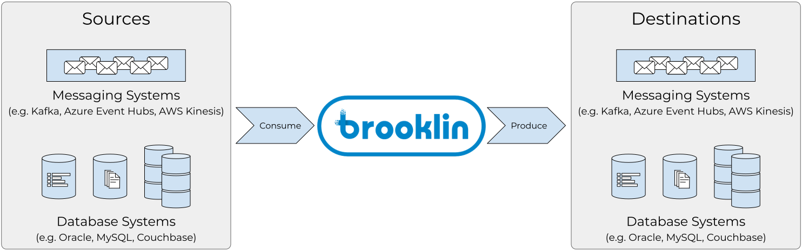

# Brooklin

Brooklin is a distributed system intended for streaming data between various hetergenous source and destination systems with high reliability and throughput at scale. It features an extensible API that enables writing extensions to support consuming/producing data from/to new systems.

Brooklin also offers a framework that enables creating data pipes, [`Datastreams`](https://github.com/linkedin/Brooklin/wiki/Brooklin-Architecture#datastream), that carry descriptions of source and destination systems to stream data across. These data pipes are then processed by [`Connectors`](https://github.com/linkedin/Brooklin/wiki/Brooklin-Architecture#connector) and [`TransportProviders`](https://github.com/linkedin/Brooklin/wiki/Brooklin-Architecture#transportprovider), modules that carry out the actual data consumption/production from/to the source/destination systems.

## Distinguishing Features

### 1. Extensible for Any Source/Destination System
- Brooklin offers a flexible API that can be extended to support a wide variety of source and destination systems. It is not confined to single type of source or destination systems.
- Source and destination systems can be freely mixed and matched. They do not have to be the same.

### 2. Scalable
- Brooklin supports creating an aribtrary number of data streams that are typically processed independently and concurrently.
- Brooklin supports partitioned data streams throughout its core implementation and APIs.
- Brooklin can be deployed to a cluster of machines (scale out) to support as many data streams as desired.

### 3. Easy to Operate
Brooklin offers a single REST endpoint for managing data streams, and offers a rich set of operations on them in addition to CRUD (e.g. `pause` and `resume`).

### 4. Offers Premium Support for Kafka
While it is not limited to any particular system, Brooklin offers first class and battle-tested support for Kafka. It provides capabilities for reading/writing massive amounts of data to/from Kafka with high reliability at scale. You can learn more about this in the [Use Cases](#use-cases) section.

### 5. Supports Change Data Capture with Bootstrap
- Brooklin supports propagating [Change Data Capture](https://en.wikipedia.org/wiki/Change_data_capture) events from data stores, e.g. RDBMS, KV stores ... etc. 
- Brooklin also supports streaming a snapshot of the existing data before propagating change events.

## Use Cases

### 1. Mirroring Kafka Clusters
Brooklin offers various advantages when used for mirroring data across Kafka clusters:

<ol type="a">
    <li><h4>
    Multitenancy</h4>
    A single Brooklin cluster can be used to mirror data across several Kafka clusters.</li>
    <li><h4>
    Fault Isolation Across Topic Partitions</h4>
    One bad partition will not affect an entire Kafka topic. Mirroring will continue for all the other healthy partitions.</li>
    <li><h4>
    Automatic Topic Creation</h4>
    The mirrored topics do not have to exist in the destination Kafka cluster in advance. Brooklin can auto-create them for you.</li>
    <li><h4>
    Whitelisting Topics Using Regex</h4>
    Select the topics to mirror using regex patterns against their names.</li>
    <li><h4>
    Pausing/Resuming Individual Partitions</h4>
    Through its <a href="https://github.com/linkedin/brooklin/wiki/Brooklin-Architecture#rest-endpoints">Datastream Management Service (DMS)</a>, Brooklin exposes REST APIs that allow finer control over replication pipelines, like being able to pause and resume individual partitions of a Kafka topic.</li>
</ol>

Check out [Mirroring Kafka Clusters](https://github.com/linkedin/brooklin/wiki/mirroring-kafka-clusters) wiki page to learn more about using Brooklin to mirror Kafka clusters

### 2. Change Data Capture
- Brooklin supports propagating [Change Data Capture](https://en.wikipedia.org/wiki/Change_data_capture) events from data stores, e.g. RDBMS, KV stores ... etc. 
- Brooklin support bootstrapping data from a datastore, i.e. streaming a snapshot of the existing data before any change events.
- MySQL support is currently under development.

### 3. Stream Processing Bridge
Brooklin can be used as the underlying streaming infrastructure feeding data to Stream Processing systems, e.g. [Apache Samza](http://samza.apache.org/), [Apache Storm](https://storm.apache.org/), [Apache Spark](https://spark.apache.org/), [Apache Flink](https://flink.apache.org/).

## Trying out Brooklin
Feel free to check out our [step-by-step tutorials](https://github.com/linkedin/brooklin/wiki/test-driving-brooklin) for running Brooklin locally in a few example scenarios.

## Documentation
- [Brooklin Architecture](https://github.com/linkedin/brooklin/wiki/Brooklin-Architecture)
- [Mirroring Kafka Clusters with Brooklin](https://github.com/linkedin/brooklin/wiki/mirroring-kafka-clusters)

## Community
- Join our [Brooklin chat room on Gitter](https://gitter.im/linkedin/brooklin)
- File a bug or request features using [GitHub issues](https://github.com/linkedin/Brooklin/issues)

## Contributing
- [Developer Guide](https://github.com/linkedin/Brooklin/wiki/Developer-Guide)
- [Code of Conduct](https://github.com/linkedin/brooklin/blob/master/CODE_OF_CONDUCT.md)

## License
Copyright (c) LinkedIn Corporation. All rights reserved.

Licensed under the [BSD 2-Clause](https://github.com/linkedin/brooklin/blob/master/LICENSE) License.
